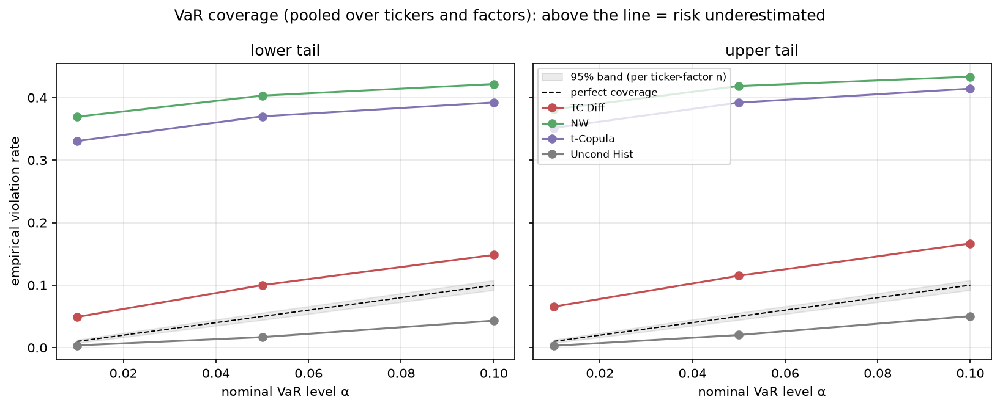
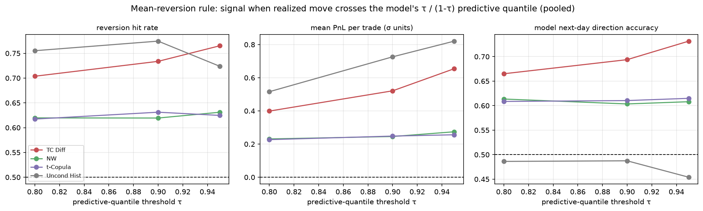
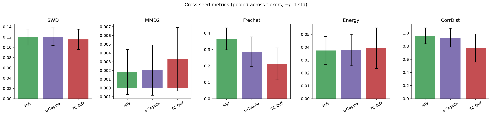
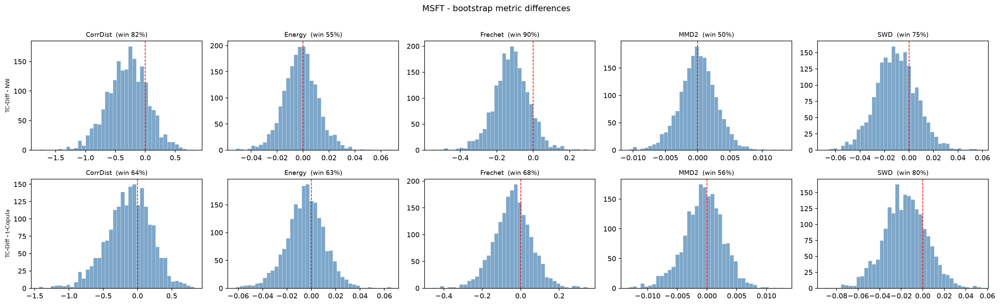

# Options Diffusion

EWMA-conditioned diffusion models for daily SVI risk-factor changes on a
small set of equity tickers. Compares two diffusion variants against two
classical baselines (Nadaraya-Watson PCA bootstrap, conditional t-copula)
across multiple training seeds, and provides a paired-bootstrap significance
test on the test set.

```
options_diffusion/
├── config.py             # tickers, EWMA alphas, hyperparameters
├── data/
│   ├── fetch.py          # Polygon + yfinance (proprietary path)
│   ├── svi.py            # raw-SVI fit per (date, expiry) + risk factors
│   └── preprocess.py     # changes, train/test split, EWMA conditioning
├── models/
│   ├── nets.py           # sinusoidal embedding, FiLM CondBlock
│   ├── diffusion.py      # ConditionalDDPM, TickerCondDDPM
│   └── baselines.py      # CondPCABootstrap (NW), CondTCopula
└── eval/
    ├── metrics.py        # SWD, MMD2, Frechet, KS, CorrDist, Energy
    ├── risk.py           # VaR + expected shortfall backtests, mean reversion
    ├── experiment.py     # cross-seed driver
    └── bootstrap.py      # paired-bootstrap significance test
```

## Data caching policy

The cache directory holds proprietary, vendor-licensed data and is in
`.gitignore`. The repo never carries the parquets.

- **`prepare_data.py --use-cache`** (default): verifies the cache files exist
  and exits. No network calls. Use this on any machine where you've copied
  your cache.
- **`prepare_data.py --fetch`**: rebuilds the cache by hitting Polygon and
  yfinance. Requires `POLYGON_API_KEY`. Don't run on a shared machine without
  authorization.

For each ticker the cache contains:

```
{ticker}_spot.parquet                  # yfinance daily close
{ticker}_raw_quotes.parquet            # filtered call quotes with IV
{ticker}_svi_risk_factors.parquet      # 8 risk-factor levels (input to experiment)
{ticker}_iv_surface.parquet            # (n_days, N_DTE*N_MONEYNESS) IV grid
{ticker}_obs_mask.npy                  # which grid cells are interpolated vs extrapolated
```

Only `*_svi_risk_factors.parquet` is required by `run_experiment.py`. The
others are useful for debugging the SVI fit.

## Install

```bash
python -m venv .venv && source .venv/bin/activate
pip install -r requirements.txt
```

Tested with PyTorch 2.x + CUDA 11.8 on RTX 3090.

## Quick smoke test (CPU, ~minutes)

```bash
python scripts/prepare_data.py --use-cache         # verify cache present
python scripts/run_experiment.py --n-seeds 1 --epochs-solo 50 --epochs-pooled 100
python scripts/plot_results.py
```

## Full run (RTX 3090, ~hours)

```bash
# Either copy your cache/ into the repo root, or fetch fresh:
#   POLYGON_API_KEY=... python scripts/prepare_data.py --fetch

python scripts/run_experiment.py --n-seeds 5
python scripts/run_bootstrap.py --n-boot 2000
python scripts/plot_results.py

# Risk-management comparison: VaR backtests + mean-reversion strategy
python scripts/run_risk_analysis.py
python scripts/plot_risk_analysis.py
```

Outputs land in `results/experiment/`, `results/bootstrap/`, and
`results/figures/`. Each seed is checkpointed to its own parquet so a
mid-run interruption can be resumed by re-running the same command.

## Two noise sources

| Script | Varies | Holds fixed |
| --- | --- | --- |
| `run_experiment.py` | training seed (5 retrains per method) | test set |
| `run_bootstrap.py`  | test-set resampling (2000 bootstraps)   | one trained model |

Both are needed to make claims about "method A beats method B": the first
captures variability from model initialization + SGD path, the second
captures variability from the small test set. Diffing the resulting
mean +/- std figures shows which source dominates.

## Methods compared

| Key | Description |
| --- | --- |
| `solo_diff` | `ConditionalDDPM` trained per-ticker on EWMA-19 conditioning |
| `tc_diff` | `TickerCondDDPM` (FiLM + ticker embedding) trained pooled across all tickers |
| `solo_nw` | PCA + Nadaraya-Watson kernel bootstrap on the 19-dim conditioning |
| `t_copula` | VIX-binned Student-t copula with NW conditional marginals |

All four use the same 19-dim conditioning: [VIX_level, VIX_ewma_short,
VIX_ewma_long] + short + long EWMAs of the 8 standardized factor changes.
Both the VIX block and the factor EWMAs are lagged by one day, so row t
conditions only on information available through t-1 — no same-day (look-ahead)
information about the day-t target.

## Configuration

Tweak hyperparameters in [options_diffusion/config.py](options_diffusion/config.py).
The most-used knobs are also exposed as CLI flags on `run_experiment.py`.

## Results

The conditional diffusion model (conditioned both on ticker identity and lagged
indicators) demonstrates capacity in excess of baselines. It is better
calibrated, superior at forecasting mean reversion, and generally superior on
distributional metrics such as Fréchet distance. It will be interesting to
explore more rigorously whether ticker conditioning conferred benefits due to
shared representation learning between the options considered, which produced a
larger train and test set.

**Calibration (VaR coverage).** After an honest, train-estimated variance
recalibration, TC-Diff tracks the perfect-coverage diagonal most closely across
both tails; the classical baselines run conservative and the unconditional
control most so.



**Mean reversion (next-day direction).** TC-Diff's conditional mean predicts the
direction of the next-day move best (rightmost panel), clearly above the
conditioned baselines (~0.60) and the unconditional control (~0.49, a coin flip).



**Distributional distance (cross-seed, ±1 std).** TC-Diff attains the lowest
Fréchet distance to the realized surface-change distribution.



The error bars are large on some of the distributional distance metrics, so I
also performed paired-bootstrap resampling tests between TC-Diff and the
baselines (2000 resamples of the test set, drawing the same indices for the real
and generated samples each time and recomputing the metric difference). The
example below (MSFT) shows the resulting distributions of TC-Diff minus each
baseline; mass to the left of the dashed zero line favors TC-Diff, with the win
rate annotated. Fréchet distance is the most consistent win across tickers
(~79% / 64% vs NW / t-Copula pooled); the other metrics are more ticker-dependent.


